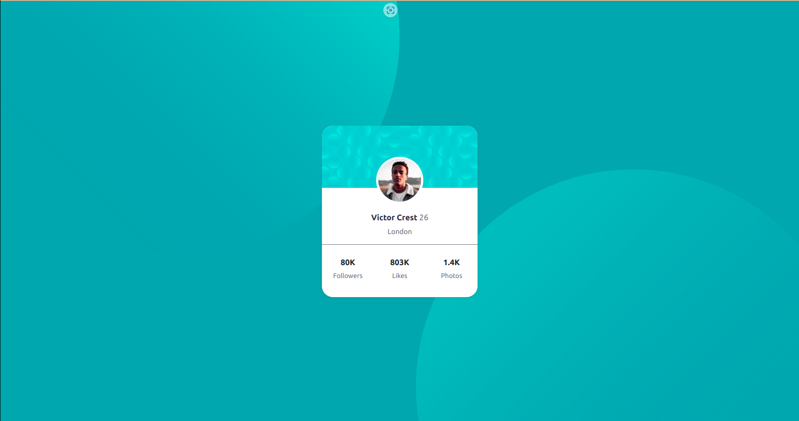

# Frontend Mentor - Profile card component solution

This is a solution to the [Profile card component challenge on Frontend Mentor](https://www.frontendmentor.io/challenges/profile-card-component-cfArpWshJ). Frontend Mentor challenges help you improve your coding skills by building realistic projects. 

## Table of contents

- [Overview](#overview)
  - [The challenge](#the-challenge)
  - [Screenshot](#screenshot)
  - [Links](#links)
- [My process](#my-process)
  - [Built with](#built-with)

- [Author](#author)


## Overview
Profile card component challenge


### Screenshot




### Links

- Solution URL: [solution URL here](https://github.com/iamkishoremahto/profile_component.git)
- Live Site URL: [live site URL here](https://profile-component-three.vercel.app/)

## My process

### Built with

- Semantic HTML5 markup
- CSS custom properties
- Flexbox
- Bootstrap 5
- Mobile-first workflow


To see how you can add code snippets, see below:

```html
<!DOCTYPE html>
<html lang="en">

<head>
  <meta charset="UTF-8">
  <meta http-equiv="X-UA-Compatible" content="IE=edge">
  <meta name="viewport" content="width=device-width, initial-scale=1.0">
  <title>Profile Card Component</title>
  <link href="https://cdn.jsdelivr.net/npm/bootstrap@5.3.2/dist/css/bootstrap.min.css" rel="stylesheet"
    integrity="sha384-T3c6CoIi6uLrA9TneNEoa7RxnatzjcDSCmG1MXxSR1GAsXEV/Dwwykc2MPK8M2HN" crossorigin="anonymous">

    <link rel="stylesheet" href="style.css">
</head>

<body>

  <div class="container-fluid d-flex align-items-center justify-content-center main_wrapper">
    
    
    <div class="row d-flex align-items-center justify-content-center">
      <div class="col-md-5 card_wrapper d-flex align-items-center justify-content-start">
        <div class="row profile">
          <div class="col profile_back">
            
          </div>
          <div class="col d-flex align-items-center justify-content-start profile_disc flex-column">
            <h5>Victor Crest <span>26</span></h5>
            <p>London</p>
          </div>
        </div>
        <div class="row d-flex align-items-center justify-content-start  social_follows">
          <div class="col">
            <h5>80K</h5>
            <p>Followers</p>
          </div>
          <div class="col">
            <h5>803K</h5>
            <p>Likes</p>
          </div>
          <div class="col">
            <h5>1.4K</h5>
            <p>Photos</p>
          </div>
        </div>
      </div>
    </div>
  </div>

  <script src="https://cdn.jsdelivr.net/npm/bootstrap@5.3.2/dist/js/bootstrap.bundle.min.js"
    integrity="sha384-C6RzsynM9kWDrMNeT87bh95OGNyZPhcTNXj1NW7RuBCsyN/o0jlpcV8Qyq46cDfL"
    crossorigin="anonymous"></script>

</body>

</html>
```
```css
:root{
    --Dark_cyan: hsl(185, 75%, 39%);
    --Very_dark_desaturated_blue: hsl(229, 23%, 23%);
    --Dark_grayish_blue: hsl(227, 10%, 46%);
}
*{
    padding: 0;
    margin: 0;
    box-sizing: border-box;
}

.main_wrapper{
    background-color: var(--Dark_cyan);
    height: 100vh;
    width: 100vw;
    position: relative;
    overflow: hidden;
    padding: 10px;
}

.main_wrapper .top{
    position:absolute;
    bottom: 40%;
    right: 50%;

}

.main_wrapper .bottom{
    position:absolute;
    top: 40%;
    left: 52%; 
}

.card_wrapper{
    background-color: rgb(255, 255, 255);
    flex-direction: column;
    min-width: 350px;
    min-height: 350px;
    /* padding: 10px; */
    padding: 0;
    overflow: hidden;
    border-radius: 25px;
    z-index: 1;
    box-shadow: rgba(99, 99, 99, 0.2) 0px 2px 8px 0px;
    
}

.card_wrapper .profile{
    display: flex;
    align-items:flex-start;
    justify-content: flex-start;
    flex-direction: column;
    width: 100%;
    padding: 0;
    margin: 0;

}

.card_wrapper .profile .profile_back{
    position: relative;
    display: flex;
  
 
    padding: 0;
    align-items: center;
    justify-content: center;
    flex-direction: column;
    background-image:url("images/bg-pattern-card.svg");

 min-height: 140px;
    width: 100%;
}
.card_wrapper .profile .col img{
    border: 5px solid rgb(255, 255, 255);
    position:absolute;
    z-index: 1;
    top: 50%;
    border-radius: 50%;
}

.profile_disc{
    margin-top: 16%;
    
}
.profile_disc h5{
    color: var(--Very_dark_desaturated_blue);
    font-size: 18px;
    font-weight: 700;
}

.profile_disc h5 span{
    color: var(--Dark_grayish_blue);
    font-weight: 400;
}
.profile_disc p{
    color: var(--Dark_grayish_blue);
}

.social_follows{
    padding-top: 30px;
    padding-bottom: 20px;
    border-top: 1px solid var(--Dark_grayish_blue);
    width: 100%;
}

.social_follows .col{
    display: flex;
    justify-content: center;
    align-items: center; 
    flex-direction: column;
}

.social_follows .col p{
    color: var(--Dark_grayish_blue);
    font-size: 15px;
    font-weight:400 ;
}

.social_follows .col h5{
    font-weight: 700;
    font-size: 18px;
}

```


## Author

- Website - [Kishore Kumar Mahto](https://github.com/iamkishoremahto)
- Frontend Mentor - [@iamkishoremahto](https://www.frontendmentor.io/profile/iamkishoremahto)

